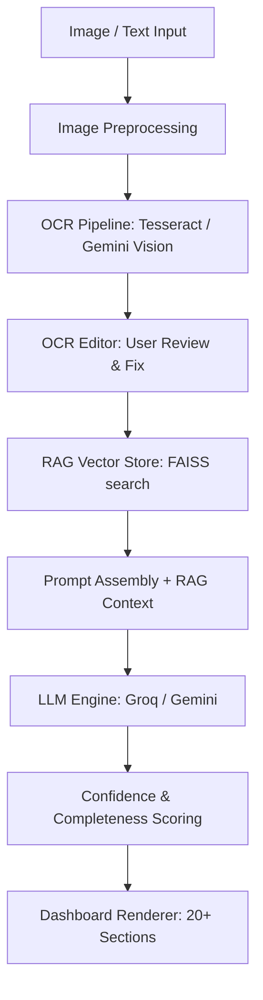

# DrugFX — Premium Medicine Intelligence & OCR Platform

DrugFX is an AI-powered medicine intelligence platform designed for everyday users, pharmacists, caregivers, healthcare professionals, and students who need reliable medicine information from images or text.

This is a production-focused software product that uses **Retrieval-Augmented Generation (RAG)**, **FAISS Vector Databases**, and **Groq LLM inference models** to deliver trustable medicine details without cognitive load.

---

## Key Features

- **Double OCR Pipeline:** Read drug labels, pill boxes, strips, or PDF reports using local Tesseract engines with automatic image enhancement, falling back to Google Gemini Vision if text confidence is low.
- **OCR Correction Panel:** Edit and verify extracted label text before analyzing it to prevent errors in dosage or administration readings.
- **Centralized Config:** Validated environment settings via Pydantic Settings. No hardcoded credentials.
- **RAG Vector Search:** Retrieves verified medical reference data from a FAISS vector index (~50 common drugs) using SentenceTransformers to anchor response contents.
- **Swappable LLM Providers:** Run inference using Groq API (`llama-3.3-70b-versatile` / `llama-3.1-8b-instant`) with automatic retry policies and cascading fallbacks, or toggle back to Google Gemini.
- **Expanded Medical Dashboard:** Presents 20+ fields (synopsis, common vs serious side effects, safety advisories, pregnancy categories, missed dose guidelines, storage info, FAQs) in a clean sidebar-navigated dashboard.
- **Export Framework:** Copy reports as formatted markdown text, download structured JSON files, or print clean PDF documents.
- **Dark/Light Theme:** Premium design language matching Apple and OpenAI aesthetics, built with vanilla CSS variables and system preference syncing.

---

## System Architecture



---

## API Endpoints

| Method | Endpoint | Description |
|---|---|---|
| `GET` | `/` | Serves Single Page Application |
| `GET` | `/api/health` | Service statuses and dependency diagnostics |
| `GET` | `/api/search/suggest` | Debounced query autocomplete (returns matching drug titles) |
| `POST` | `/api/analyze/text` | Processes direct drug queries or corrected OCR strings |
| `POST` | `/api/analyze/image`| Upload files, runs OCR, returns extracted text and confidence |

---

## Setup & Running

### 1. Configure Environment Variables
Copy the template file to `.env` in the `project/` directory:
```bash
cp project/.env.example project/.env
```
Open `project/.env` and insert your API keys:
- `GROQ_API_KEY`: Required for primary inference (from [console.groq.com](https://console.groq.com)).
- `GEMINI_API_KEY`: Optional, used for vision OCR fallback.

### 2. Running Locally (Uvicorn)

Create and activate a Python virtual environment:
```bash
python -m venv venv
# On Windows:
venv\Scripts\activate
# On Linux/macOS:
source venv/bin/activate
```

Install production requirements:
```bash
pip install -r project/requirements.txt
```

Launch the server:
```bash
python project/api.py
```
Open [http://localhost:8000](http://localhost:8000) in your browser.

---

## Running with Docker

You can launch the containerized application directly using Docker Compose (which installs tesseract-ocr automatically):

```bash
# Build and run container
docker-compose up --build -d

# Check health checks status
docker ps
```
The app will be active on port `8000`.

---

## Engineering Design Choices

1. **Vanilla CSS variables** are used to prevent framework overhead (like Tailwind) while providing clean dark/light mode toggles and print-friendly media formats.
2. **Debounced Suggestion fetching** (300ms) minimizes REST overhead on keys typed while maintaining responsiveness.
3. **Multi-model fallbacks** and exponential retry delays in the Groq provider shield the user from transient `429 Rate Limit` blockades.
4. **Pydantic Settings** validates environments early and errors at runtime startup if config formats are incorrect.
